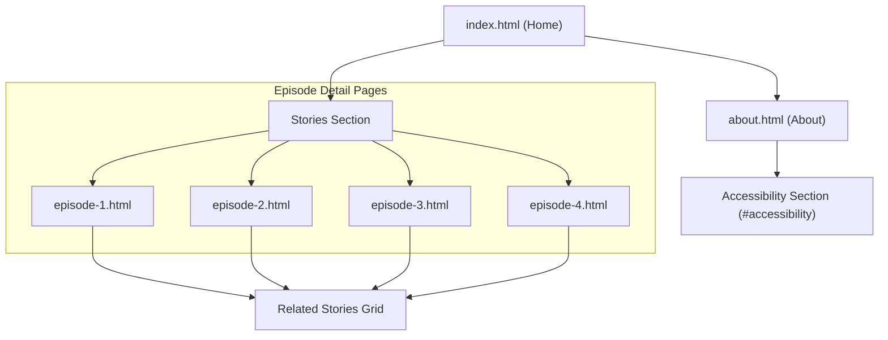

# StoryCast Sitemap

This sitemap outlines the hierarchical structure of the StoryCast microsite, providing a clear overview of the site's navigation and content organization.

## Site Structure

## Page Descriptions

### 1. Home (`index.html`)
The main entry point featuring a hero carousel, featured stories, and a clear call to action.

### 2. About (`about.html`)
Detailed information about the StoryCast mission, the team, and a comprehensive accessibility statement.

### 3. Episode Pages (`stories/episode-x.html`)
Individual pages dedicated to specific stories/episodes, featuring:
*   Header meta information (date, duration, original source).
*   Accessible native video player with WebVTT captions.
*   Dynamic transcript loader (loading from external text files).
*   Related stories grid for better user engagement.

## Technical Assets

*   **Sass Layers:** `base`, `layout`, `components`, `utilities`.
*   **Media:** Located in `assets/video/` and `assets/transcripts/`.
*   **Scripts:** Inline functional scripts for navigation toggles and transcript loading.
